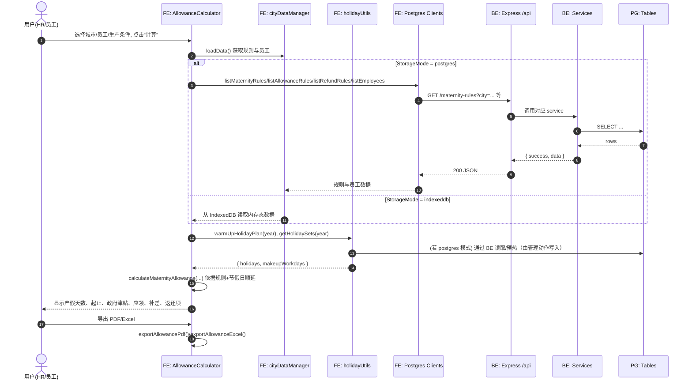
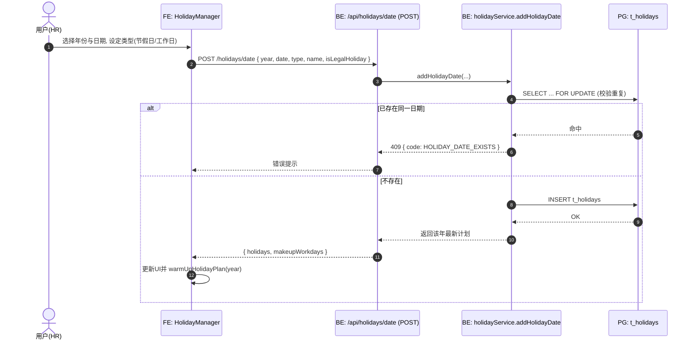
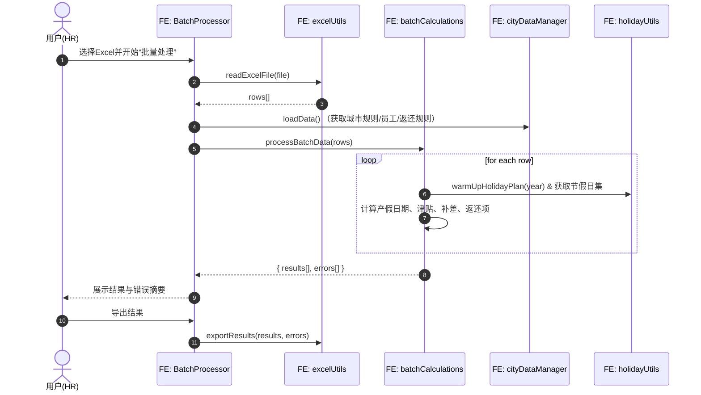

# 生育津贴与产假管理系统｜核心时序图

> 依据实现逻辑绘制（参考 `src/components/*`, `src/utils/*`, `src/api/*`, `server/src/*`）。

---

## 1. 产假津贴计算流程（含双存储模式）



---

## 2. 节假日管理：新增日期



---

## 3. 产假规则导入（Postgres模式，全量覆盖）

```mermaid
sequenceDiagram
    autonumber
    actor U as 用户(HR)
    participant MR as FE: MaternityRulesManager
    participant CDM as FE: cityDataManager
    participant PC as FE: postgresMaternityRulesClient
    participant API as BE: /api/maternity-rules/import
    participant SVC as BE: maternityRuleService.importRules
    participant DB as PG: t_maternity_rules

    U->>MR: 选择Excel文件并导入
    MR->>CDM: setMaternityRules(parsedRules)
    alt StorageMode = postgres
        CDM->>PC: importMaternityRules(rules)
        PC->>API: POST /maternity-rules/import { rules }
        API->>SVC: importRules()
        SVC->>DB: BEGIN; TRUNCATE t_maternity_rules; BULK INSERT; COMMIT
        DB-->>SVC: OK
        SVC-->>API: { count }
        API-->>PC: 200 JSON
        PC-->>CDM: { count }
        CDM->>PC: listMaternityRules()
        PC->>API: GET /maternity-rules
        API->>SVC: findAll order by city/type
        SVC->>DB: SELECT
        DB-->>SVC: rows
        SVC-->>API: { data }
        API-->>PC: 200 JSON
        PC-->>CDM: 规则刷新
        CDM-->>MR: 通知刷新UI
    else StorageMode = indexeddb
        CDM->>CDM: 合并/覆盖内存与IndexedDB
        CDM-->>MR: 通知刷新UI
    end
```

---

## 4. 批量处理：Excel导入并计算



---

## 5. 员工登录校验（前端模拟）

```mermaid
sequenceDiagram
    autonumber
    actor E as 员工
    participant APP as FE: App.js(Login)
    participant DMA as FE: dataManagementApi.getEmployeesApi
    participant CDM as FE: cityDataManager

    E->>APP: 输入姓名并选择“员工”登录
    APP->>DMA: getEmployeesApi()
    DMA->>CDM: loadData(); getAllEmployees()
    CDM-->>DMA: employees[]
    DMA-->>APP: { ok: true, data: employees }
    APP->>APP: 过滤匹配姓名, 校验存在
    alt 匹配成功
        APP-->>E: 登录成功, 进入“产假津贴计算”
    else 未匹配
        APP-->>E: 提示“员工信息不存在”
    end
```
