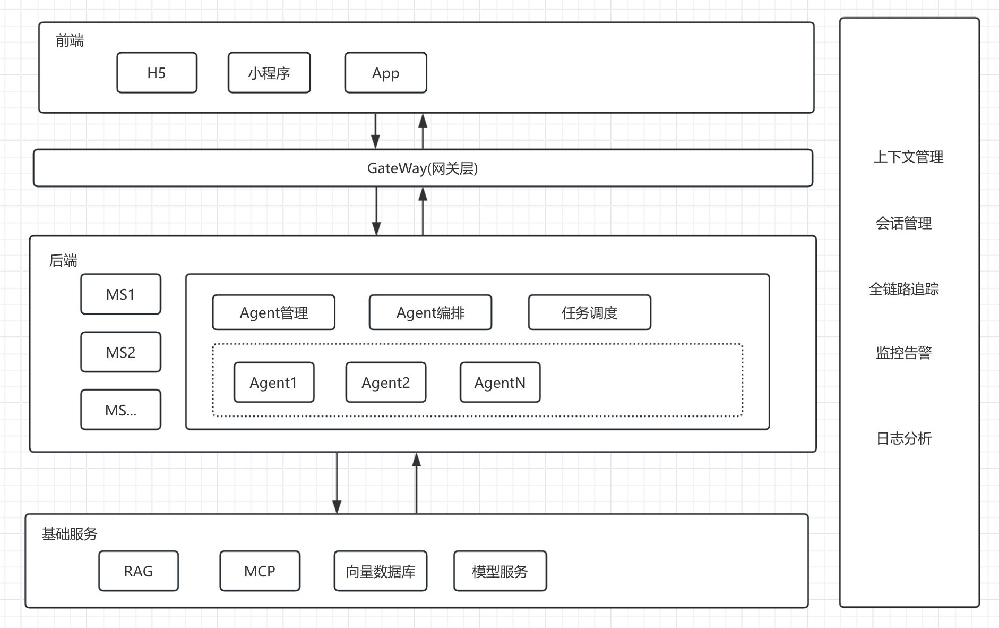
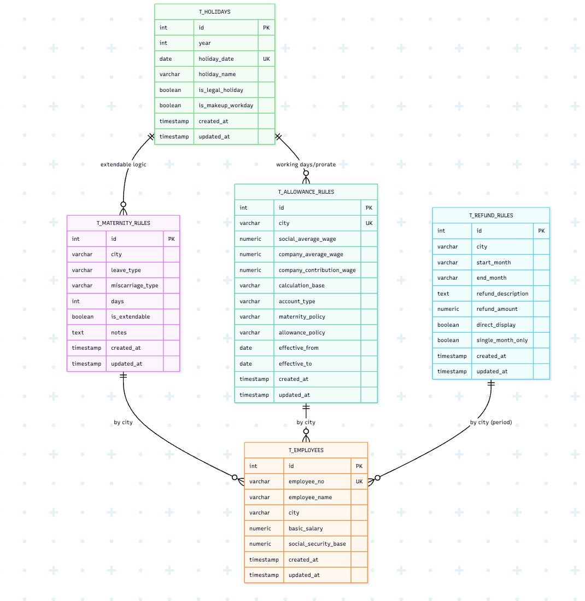

## 1. 架构设计
### 1.1 产品架构图

### 1.2 技术架构图

## 2. 数据模型（Postgres）

### 2.1 ER 图

- `t_maternity_rules`：城市×类型×（流产类型可空）唯一；字段含 `is_extendable`。
- `t_allowance_rules`：城市唯一；含 `calculation_base`、`account_type`、政策说明、有效期。
- `t_employees`：员工编号唯一；城市、基本工资、社保等。
- `t_refund_rules`：`city/start_month/end_month` 索引；导入按全量覆盖策略。
- `t_holidays`：节假日与调休上班日；`holiday_date` 唯一。

## 3. API 设计（后端）
- 基础路径：`/api`
  - `GET/POST/PATCH/DELETE /maternity-rules`，`POST /maternity-rules/import`
  - `GET/POST/PATCH/DELETE /allowance-rules`，`POST /allowance-rules/import`
  - `GET/POST/PATCH/DELETE /refund-rules`，`POST /refund-rules/import`
  - `GET/POST/PATCH/DELETE /employees`，`POST /employees/import`
  - `GET /holidays?year=YYYY`，`GET /holidays/years`，`POST /holidays/plan`，`POST/PATCH/DELETE /holidays/date`，`POST /holidays/import`
- 返回格式：`{ success, data?, error?: { code, message } }`；409 处理重复冲突。

## 4. 关键业务规则
- **产假计算**
  - 维度：法定、难产、多胞胎、晚育/生育/奖励、流产、二孩三孩（绍兴）、广州补充难产。
  - 顺延：由 `isExtendable` 决定；节假日集来自 `HolidayManager`。
  - 结束日计算需考虑法定节假日与调休上班日。
- **津贴与补差**
  - 生育津贴基数：`min(社平×3, 单位上年度平均工资)`；部分城市特殊计算（如成都按年化/365，天津除数30.4）。
  - 公司补差：`max(0, 应领取 - 政府发放)`；个人账户需扣个人社保。
  - 社保个人缴费按整月计（期间工资/社保调整支持分段计算）。
- **批量处理**：Excel 模板→导入→校验→逐条计算→汇总与导出。
- **统计口径（重要）**：按城市统计不同类型总和时，默认排除“流产假”。

## 5. 前端模块与文件
- `src/components/AllowanceCalculator.js`：主计算、日历渲染、导出。
- `src/components/CityDataManager.js`：产假/津贴/返还/员工/节假日管理容器。
- `src/utils/holidayUtils.js`：节假日计划、工作日统计、顺延。
- `src/utils/maternityCalculations.js`、`src/utils/batchCalculations.js`：计算逻辑与批处理。
- `src/api/dataManagementApi.js`、`src/api/postgres*.js`：数据接入。

## 6. 技术栈
- **前端**：React 18、date-fns、xlsx、file-saver、html2pdf.js、CSS3。
- **后端**：Node.js、Express、Sequelize。
- **数据库**：Postgres。
- **本地存储**：IndexedDB。
- **测试**：Playwright E2E（参见 `tests/e2e/`）、Jest（如适配）。

## 7. 非功能需求
- **性能**：前端单次批处理建议 ≤1000 行；后端导入批量事务。
- **稳定性**：健康检查 `GET /api/health`；统一错误码；SQL 日志开关。
- **安全**：当前无后端鉴权；部署需由网关/反代限制写接口。
- **可运维**：DB 连接取自环境变量或 `src/config/storage.config.json`。

## 8. 上线与环境
- 本地：IndexedDB 或 Postgres（`.env`、`src/config/storageConfig.js`）。
- 后端端口：默认 `3001`。

## 9. 核心流程（摘要）
- 详见 `PRD_sequence.md`：
  - 产假津贴计算（双存储模式）
  - 节假日新增（含重复校验）
  - 产假规则导入（Postgres 全量覆盖）
  - 批量处理（Excel 导入→计算→导出）
  - 员工登录校验（前端模拟）

## 10. 验收标准（节选）
- 计算正确性：以深圳/难产/双胎/2025-03-01 为例，结束日期随节假日与调休正确顺延；切换个人账户联动正确。
- 数据约束：规则/城市唯一性、节假日日期唯一，重复返回 409。
- 返还规则：`YYYY-MM` 格式且 start ≤ end；导入按全量覆盖。

## 11. 风险与开放问题
- **[统计维度]** 报表（月/季/年）与维度组合（城市×类型×账户方式）确认。
- **[流产假报表]** 是否需在报表中单独附录“流产假”统计（默认不计入城市总览）。
- **[津贴基数优先级]** 城市差异化的优先级规则确认。
- **[返还规则跨月]** “仅单月有效”跨月分摊是否参与计算。
- **[跨年顺延]** 产假跨年顺延的严谨性与测试覆盖。
- **[鉴权与审计]** 后端鉴权与日志的引入时机。

## 12. 里程碑建议
- **M1**：IndexedDB 模式功能完备（计算台、管理、批量、导出）。
- **M2**：
  - 1. 产假申请流程化
2. 基础数据加版本号

