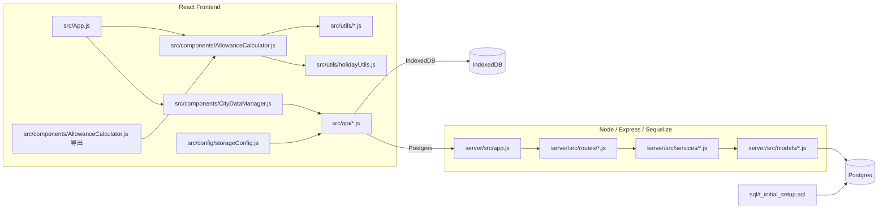
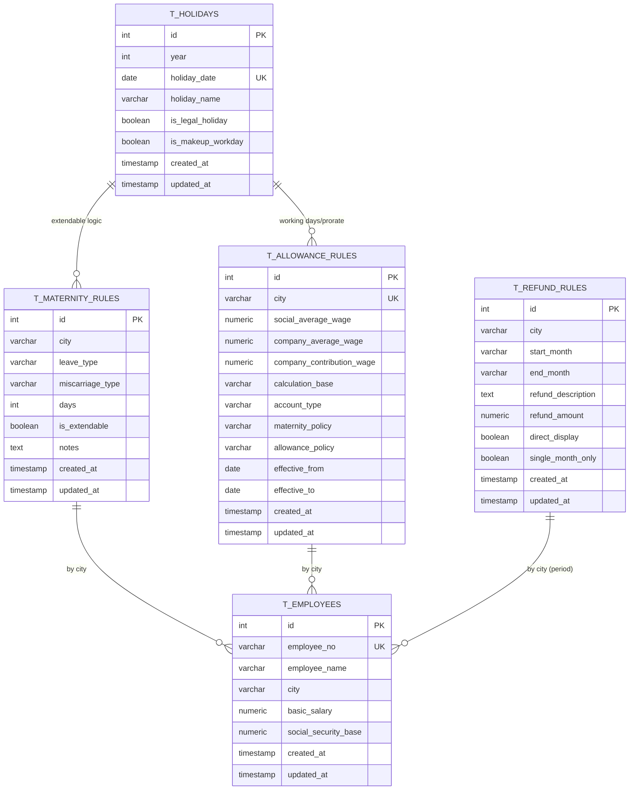

技术架构图

```mermaid
graph LR
    subgraph Frontend[React Frontend]
      App[src/App.js]
      Calc[src/components/AllowanceCalculator.js]
      CityMgr[src/components/CityDataManager.js]
      Utils[src/utils/*.js]
      APIClient[src/api/*.js]
      Storage[src/config/storageConfig.js]
      Export[src/components/AllowanceCalculator.js 导出]
      Holiday[src/utils/holidayUtils.js]
    end

    subgraph Backend[Node / Express / Sequelize]
      AppBE[server/src/app.js]
      Routes[server/src/routes/*.js]
      Services[server/src/services/*.js]
      Models[server/src/models/*.js]
    end

    DB[(Postgres)]
    SQL[sql/t_initial_setup.sql]

    App --> Calc
    App --> CityMgr
    Calc --> Utils
    Calc --> Holiday
    CityMgr --> APIClient
    Storage --> APIClient
    Export --> Calc

    APIClient -->|IndexedDB| IDB[(IndexedDB)]
    APIClient -->|Postgres| AppBE
    AppBE --> Routes --> Services --> Models --> DB
    SQL --> DB
```

ER图

```mermaid
erDiagram
  T_MATERNITY_RULES {
    int id PK
    varchar city
    varchar leave_type
    varchar miscarriage_type
    int days
    boolean is_extendable
    text notes
    timestamp created_at
    timestamp updated_at
  }

  T_ALLOWANCE_RULES {
    int id PK
    varchar city UK
    numeric social_average_wage
    numeric company_average_wage
    numeric company_contribution_wage
    varchar calculation_base
    varchar account_type
    varchar maternity_policy
    varchar allowance_policy
    date effective_from
    date effective_to
    timestamp created_at
    timestamp updated_at
  }

  T_EMPLOYEES {
    int id PK
    varchar employee_no UK
    varchar employee_name
    varchar city
    numeric basic_salary
    numeric social_security_base
    timestamp created_at
    timestamp updated_at
  }

  T_REFUND_RULES {
    int id PK
    varchar city
    varchar start_month
    varchar end_month
    text refund_description
    numeric refund_amount
    boolean direct_display
    boolean single_month_only
    timestamp created_at
    timestamp updated_at
  }

  T_HOLIDAYS {
    int id PK
    int year
    date holiday_date UK
    varchar holiday_name
    boolean is_legal_holiday
    boolean is_makeup_workday
    timestamp created_at
    timestamp updated_at
  }

  T_MATERNITY_RULES ||--o{ T_EMPLOYEES : "by city"
  T_ALLOWANCE_RULES ||--o{ T_EMPLOYEES : "by city"
  T_REFUND_RULES ||--o{ T_EMPLOYEES : "by city (period)"
  T_HOLIDAYS ||--o{ T_MATERNITY_RULES : "extendable logic"
  T_HOLIDAYS ||--o{ T_ALLOWANCE_RULES : "working days/prorate"
```